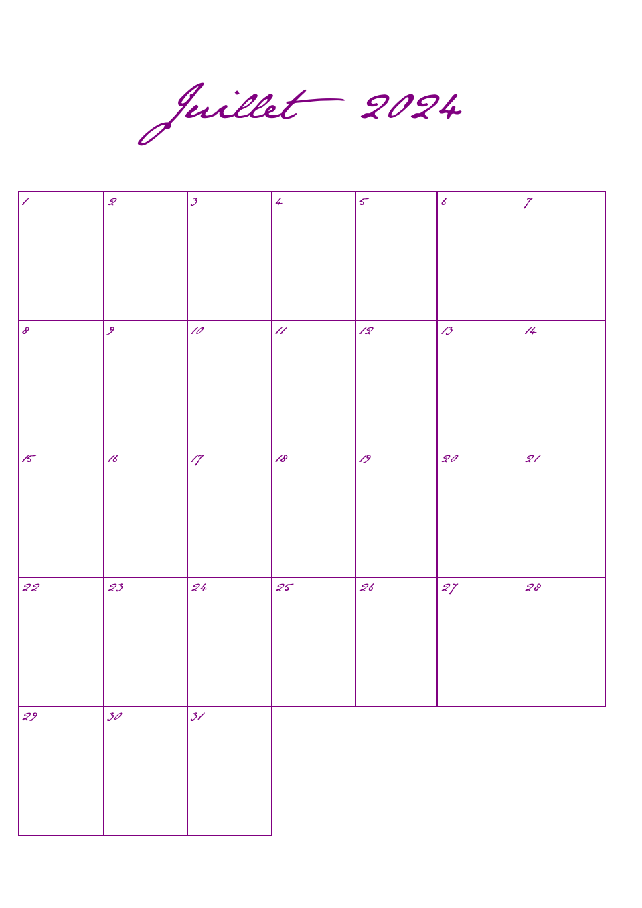
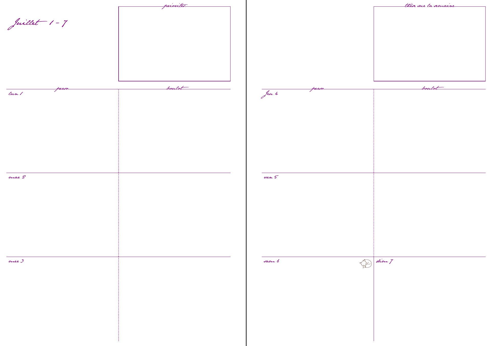

# agenda-template

## Installation and usage

* First, install dependencies: `pip install -r requirements.txt`
* Let `playwright` download its chromiun build: `playwright install chromium`
    * it will be stored in `~/.cache/ms-playwright/`
    * it can be removed at any time with `playwright uninstall`
* Then, install the package locally with `pip install . -e`
* Run `python3 script/make_agenda.py <target year> <target month> <number of months>`

## Description

The package uses python string api to edit some targeted fields in the html/css template files, in order to automate the generation of the agenda for each specific months (i.e., hiding the empty days, filling in the correct dates...). It also reads most of the css parametrization from a yaml config file, such that several preset can be used.

The generation of the pdf from the html/css is made by invoking chromium through [playwright](https://github.com/microsoft/playwright-python), because all the python-based html-to-pdf converters library we found out there (specifically: [weasyprint](https://github.com/Kozea/WeasyPrint), [wkhtmltopdf](https://github.com/wkhtmltopdf/wkhtmltopdf), [xhtml2pdf]((https://github.com/xhtml2pdf/xhtml2pdf))) do no handle some css syntax, in particular grids.
A non-microsoft alternative to playwright is [pyppeteer](https://github.com/pyppeteer/pyppeteer), but is not maintained for some years.

The python templater itself is a very inefficient series of str.replace() to edit the loaded template.

While it is all made toward a specific design of agenda, the templates should be easy enough to adapt to a new one with a similar structure (one week per double page).
Otherwise, it can be used as a starting block to write new templates and enrich the python templater with desired features.

## Examples

Sample output of what this looks like:

## todos

* scale down title font if the week titles go two-liners
